# 智能计算机实验

## 我对于此课程实验的看法

关于此实验的指导比较少，主要来源就是寒武纪论坛和一些大体的指导，没有详细的介绍，而这门实验的测试是在服务器上进行的，坑比较多，因此可能会耗费比较多的时间（除非你直接补充那七个文件而且不用在服务器上测试，平台提交直接AC）

这篇文章的主要目的是提供一个比较详细的实验完成方法，并且减少大家在完成实验过程中踩的坑，但是不会提供具体的代码

**注意**：如果你想快速顺利的完成此实验，可以观看这篇文章

​         如果你想锻炼自己根据报错找 bug 的能力或者根据报错自学 tensorflow 的能力，可以先选择自己完成实验，如果实在是感到      困难，可以再来观看这篇文章

<!--more-->
## 实验一

(听说不用快速幂和多核拆分就能过，哭了)

1. 进入 /opt   将压缩包解压
2. 进入 /opt/AICSE-demo-student/env  执行 source env.sh
3. cd tensorflow-v1.10   执行 source env.sh   然后激活虚拟环境

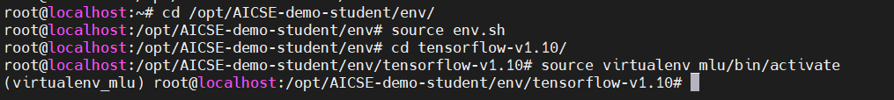

3. 以上两步非常重要，在每一次进入服务器之后都要执行，否则会在执行脚本或编译的时候出现奇怪的错误
4. 进入 /opt/AICSE-demo-student/demo/style_transfer_bcl/src/bangc/PluginPowerDifferenceOp ，开始进行代码的补充，我建议的顺序如下：
   - plugin_power_difference_kernel.mlu 
   - plugin_power_difference_kernel.h
   - powerDiff.cpp
   - plugin_power_difference_op.cc
   - cnplugin.h

5. 在 .mlu 中进行 PowerDifference 算子的实现，这个部分比较简单，需要注意的地方为 GDRAM 和 NRAM 之间的转换，我的理解就是参数中的变量都是 GDRAM，你在函数中创建的 `__nram__ half` 变量都是 NRAM，而你的实现大概能分为三个阶段：

   - 初级阶段，实现了基本的算子功能，能得到60分
   - 中级阶段，用快速幂进行实现，能够小幅降低在 CNRT 上的延时，能得到70分（不过不用快速幂可能也行
   - 高级阶段，实现多核拆分计算，能够同时在多个核上进行运算，能得到100分（bushi

   此部分需要用到一些 bangc 的内置函数，使用其中的三个函数就能实现此算子：

   - __memcpy (目标地址，源地址，长度，RAM类型转换)     功能为将源地址之后一定长度的数据拷贝到目标地址

     一个栗子：`__memcpy(input1_nram+i*Seg, input1+i*Seg, Seg*sizeof(half), GDRAM2NRAM);`

   - __bang_sub (目标地址，被减数，减数，长度)     功能为进行一定长度的向量减法，结果储存在目标地址

     一个栗子：`__bang_sub(input1_nram+i*Seg, input1_nram+i*Seg, input2_nram+i*Seg, Seg);`

   - __bang_mul     与上面类似，只不过进行的是乘法

   关于函数的具体使用以及更多的函数介绍，可以参考 bangc 的开发指导书

   噢，忘说了，函数的参数大致是这样：`__mlu_entry__ void PowerDifferenceKernel(half* input1, half* input2, int pow, half* output, int len)`

6. 补全 plugin_power_difference_kernel.h，非常简单，只要和 .mlu 中的函数参数一致即可
7. 补全 powerDiff.cpp，这部分若要自己写可能比较困难，我的建议是参照本来就有的其他算子的实现来完成，需要注意的是将其中的 *Kernel 改成自己的 PowerDifferenceKernel，当然还可能有其他的都需要改成 PowerDifference 对应的格式，在参照其他算子完成补全后，需要注意的是，如果你想使用多核拆分的话，还要修改两个地方：
   - 将 dim.x = 1 改为 dim.x = 8
   - 将 cnrtFunctionType_t c 改为 CNRT_FUNC_TYPE_UNION2

8. 补全 plugin_power_difference_op.cc，这个比较难搞，即使参照其他算子，也比较烦人，我对于此部分的建议是选择的参照算子的实现可以选择简单的，并且不要思考的太过于复杂（
9. 补全 cnplugin.h，参照上面的实现，定义 PowerDifference 对应的结构，结构指针以及 plugin_power_difference_op.cc 中函数的声明

10. 在补全了以上文件之后，就可以进行算子的测试啦，在 xxx/src/bangc/PluginPowerDifferenceOp 中执行以下两句：
    - bash make.sh
    - ./power_diff_test

    就可以看到测试结果，正确的测试结果大致如下：

    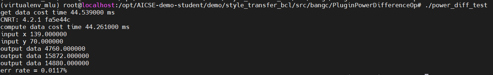

11. 如果你的运行结果和上图差不多，说明你前面的实现已经差不多完成啦，接下来就要进行 cnplugin 的集成，步骤如下：

    - 将 cnplugin.h 复制到下面两个目录中：

      /opt/AICSE-demo-student/env/neuware/include/

      /opt/AICSE-demo-student/env/Cambricon-CNPlugin-MLU270/common/include/

    -  在 /opt/AICSE-demo-student/env/Cambricon-CNPlugin-MLU270 处执行 bash build_cnplugin.sh --mlu200，如果编译的最后显示 build success，说明你编译成功，会在 ./build 文件夹中生成新的 libcnplugin.so

    - 将新生成的 libcnplugin.so 复制到 /opt/AICSE-demo-student/env/neuware/lib64/ 文件夹下

12. 很快啊，cnplugin 的集成就完成了，接下来要进行的就是 TensorFlow 算子集成，此部分首先需要按照 /opt/AICSE-demo-student/demo/style_transfer_bcl/src/tf-implementation/tf-add-power-diff/readme.txt  即下图：

    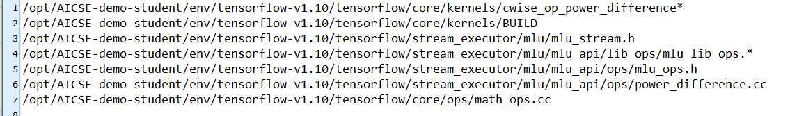

    将此文件夹下的其他文件复制到 readme.txt 里对应的文件夹中，在进行这一步时请务必仔细，否则在稍后编译时可能会产生各种各样奇怪的 bug，在复制完成后，如果你直接在 /opt/AICSE-demo-student/env/tensorflow-v1.10 中执行 bash build_tensorflow-v1.10_mlu.sh，有 99.9% 的可能会出现以下的错误：

    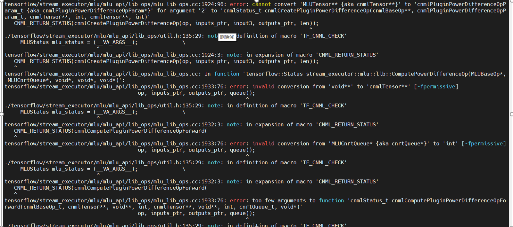

    根据错误信息可以看出来，实验提供的 mlu_lib_ops.cc 和你补充的 plugin_power_difference_op.cc  中 ，cnmlCreatePluginPowerDifferenceOp 以及 cnmlComputePluginPowerDifferenceOpForward 的参数不同，你需要选择修改其中之一来保证两个文件中的参数一致，我的建议是修改实验提供的 mlu_lib_ops.cc，因为修改起来比较简单，并且在其中你可以使用 nullptr 来填充参数，，下面是我的实现以供参考：
    
    mlu_lib_ops.cc 中对于 plugin_power_difference_op的调用：
    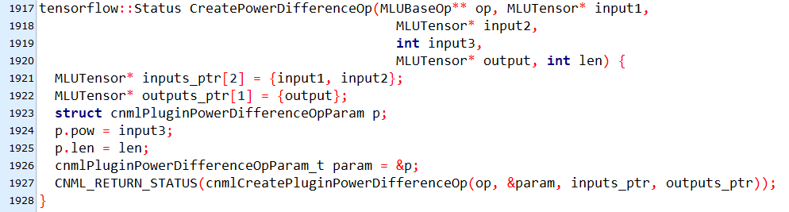
    plugin_power_difference_op.cc 中 plugin_power_difference_op 的参数：
    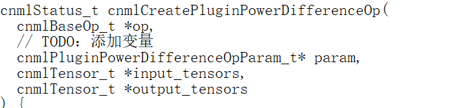
    mlu_lib_ops.cc 中对于 cnmlComputePluginPowerDifferenceOpForward的调用：
    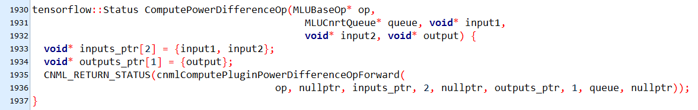
    plugin_power_difference_op.cc 中 cnmlComputePluginPowerDifferenceOpForward 的参数：
    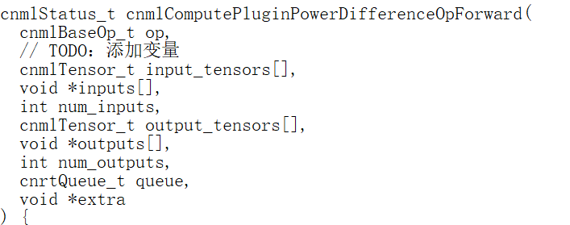

    若在完成这一步之后，你的编译出现socket错误，就要将 .sh 文件中的 job_num 改为 16 ，你应该就可以成功的进行 tensorflow的编译啦（可能需要较长的时间

13. 最后就是补全 .../src/online_mlu/power_difference_test_bcl.py 和 .../src/online_cpu/power_difference_test_cpu.py 文件 ， 执行 python power_difference_test_xxx.py 进行测试，这两个文件的补全比较简单，并且是基本一样的，只是在 test_bcl 中有一个特殊的地方要修改，因此我的建议是先进行 cpu 的测试，成功的测试结果如下图：

    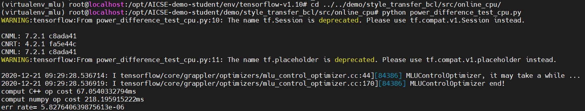

    而当你将补全的地方复制到 test_mlu.py 中，进行测试，你会得到以下结果：

    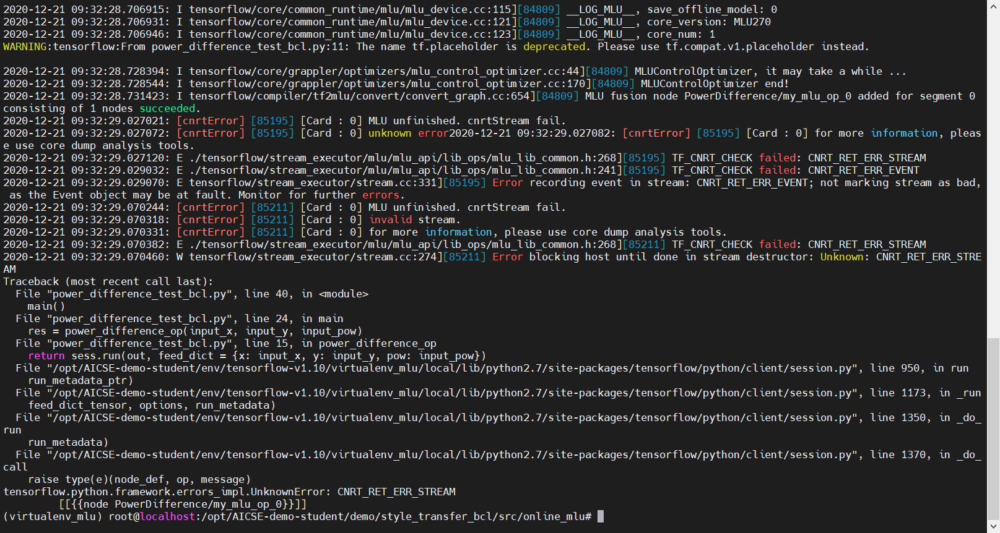

    我在开始的时候将代码中的   os.environ['MLU_VISIBLE_DEVICES'] = "0"   改为 os.environ['MLU_VISIBLE_DEVICES'] = "1" ，然后再次测试：

    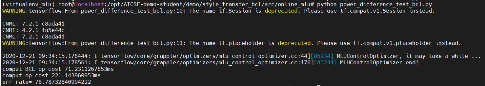

    虽然错误率看上去比较高，但是交上去的话可以过。不过这种改的方法应该是不正确的, 而且在实验二中这个问题会同样出现但是无法解决， 出现这种情况的原因应该是在多核拆分的循环的最后一次中数据的长度不足 Seg，因此我们需要将最后的一次单独提取出来做计算，之后的结果是这样的：

    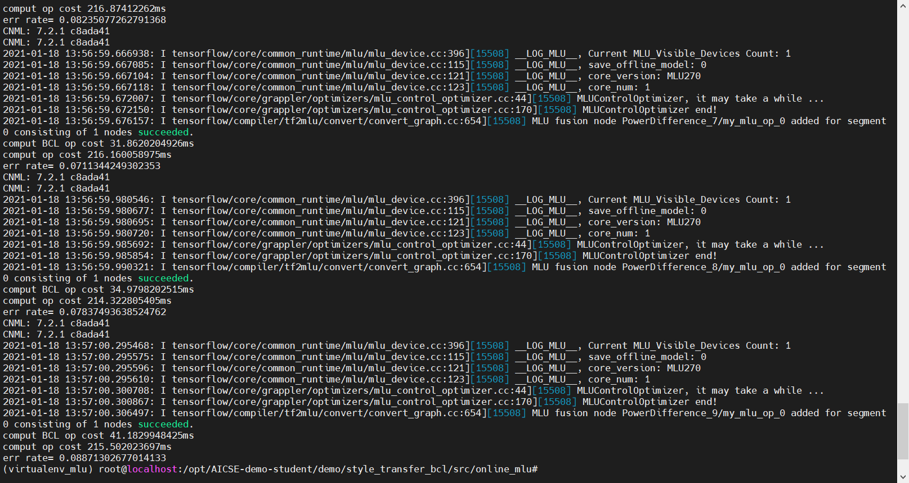

    可以看到错误率比之前低了很多

14. 最后，如果你使用了快速幂，多核拆分，但是在 MLU 上仍然有着 100+ ms 的延迟，那么你需要在 test_bcl.py 中进行如下修改：

    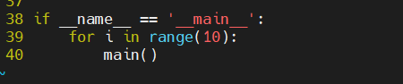

    因为 MLU 的启动时间比较慢，所以可以多次运行来获得更低的延迟，如果这样你还不能拿到满分，请多提交几次

15. 补充：如果你提交到平台上的结果为 JSON 格式错误，说明你代码写错了，请确保你在如上测试中都成功的运行出了正确的结果，如果你在实验的完成过程中出现了其他错误，请看一下自己是不是漏了某个步骤，或者某个步骤做的不够仔细，如果还是不行的话，请前往和助教对线或者在群里请求帮助，此外，请务必不要重启你的服务器，~~否则就会像我一样丢掉所有数据然后重新配一遍~~

## 实验一选作（四选一）-- softmax 算子实现

### softmax 算子介绍

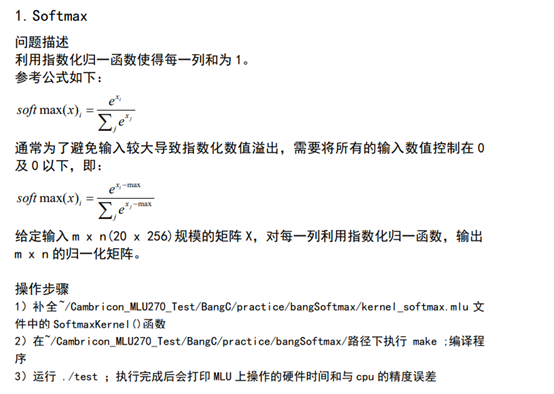

### 算子实现

因为输入数据的规模为 20 × 256，共 20 行，256 列，我们首先要找出每一列的最大值，方法为每次接受一行的数据，对于每一列来说，如果新输入的数据大于最大值，就更新，否则不变，然后将每一列的所有数减去这个最大值，求出 e 关于这个数的指数，再全部加起来，然后取一个倒数，然后对于每一列的每一个数，乘以之前计算出来的倒数，这样计算出来的结果即为正确结果

### 具体代码

```cpp
#include "mlu.h"
#define input_size 20     # 列数
#define input_num  256    # 行数


#define LEN  256*20
__mlu_entry__ void SoftmaxKernel(half* input, half* output)
{  
   __nram__ half input_nram[input_num];
   __nram__ half output_nram[LEN];
   __nram__ half temp1_nram[input_num];
   __nram__ half temp2_nram[input_num];
   __nram__ half comL_nram[input_num];
   __nram__ half sum_nram[input_num];
   __nram__ half sum_recip_nram[input_num];
   __nram__ half mulL_nram[input_num];
   __nram__ half mulR_nram[input_num];
   __nramset_half(comL_nram, input_num, -3000.0);
   __nramset_half(sum_nram, input_num,0.0);
   
   for(int32_t i=0; i<input_size;i++)
    {
       __memcpy(input_nram, input+i*input_num, input_num*sizeof(half),GDRAM2NRAM);  # 分别获取每行的输入数据
       __bang_gt(temp1_nram,comL_nram,input_nram,input_num);   # 若输入值小于最大值，则对应位置为1
       __bang_not(temp2_nram,temp1_nram,input_num);            # 若输入值大于最大值，则对应位置为1
       __bang_mul(mulL_nram,temp1_nram,comL_nram,input_num);   # 最大值不变的位置，置最大值
       __bang_mul(mulR_nram,temp2_nram,input_nram,input_num);  # 最大值改变的位置，置输入值
       __bang_add(comL_nram,mulL_nram,mulR_nram,input_num);    # 相加得到每列新的最大值
    }

   for(int32_t i=0; i<input_size;i++)
     {
       __memcpy(input_nram, input+i*input_num, input_num*sizeof(half),GDRAM2NRAM);  # 分别获取每行的输入数据
       __bang_sub(temp1_nram,input_nram,comL_nram,input_num);  # 每一列减去该列最大值
       __bang_active_exp(temp2_nram,temp1_nram,input_num);     # 求 e 关于 j-max 的指数
       __bang_add(sum_nram,sum_nram,temp2_nram,input_num);     # 将所有的指数相加得到分母
     }
    __bang_active_recip(sum_recip_nram,sum_nram,input_num);    # 求出分母的倒数

   for(int32_t i=0; i<input_size;i++)
       {
         __memcpy(input_nram, input+i*input_num, input_num*sizeof(half),GDRAM2NRAM);  # 分别获取每行的输入数据
        __bang_sub(temp1_nram,input_nram,comL_nram,input_num);         # 每一列减去该列最大值
        __bang_active_exp(temp2_nram,temp1_nram,input_num);            # 求 e 关于 i-max 的指数，即分子
        __bang_mul(temp2_nram,temp2_nram,sum_recip_nram,input_num);    # 将分子和分母的倒数相乘，得到结果
        __memcpy(output+i*input_num,temp2_nram,input_num*sizeof(half),NRAM2GDRAM);  # 将结果返回到输出中
      }
 }
```

### 实验总结

该实验对于 softmax 算子进行实现，难点在于如何灵活的运用 bangc 提供的各种函数对于数据进行操作和计算，只要按照 softmax 的定义对式子一步一步的计算，并合理的运用 bangc 提供的函数，就可以比较简单的实现 softmax 算子，在这个过程中，bangc 的教学文档起到了很大的作用，文档对于各种各样的函数做出了详细的解释与注意事项，可以对算子实现起到很大的帮助

## 实验二

### 模型量化

该部分代码和量化手段已经提前给出，直接按照[教程](http://forum.cambricon.com/uploadfile/user/file/20200714/1594717975554836.pdf)即可完成。

### 在线推理

在线推理部分主要分为两块，分别需要补全

/opt/AICSE-demo-student/demo/style_transfer_bcl/src/online_mlu/transform_mlu.py 和

/opt/AICSE-demo-student/demo/style_transfer_bcl/src/online_cpu/transform_cpu.py

#### online_cpu

在cpu部分里，使用到的模型是非量化后的模型文件。

该部分需要补全两个函数run_ori_power_diff_pb和run_numpy_pb

- **run_ori_power_diff_pb** ：直接按照同文件下的run_ori_pb逻辑进行书写，但是要注意该函数使用的计算图与run_ori_pb不同点在于将原生的差平方计算算子改成了实验一中集成的power_difference算子，所以只需要我们进行feed数据（**不需要**重新实现power_difference的计算），将pow值传递至计算图计算。而其在**计算图中的各节点信息可使用[神经网络模型可视化网站](https://lutzroeder.github.io/netron/)进行查找**。

  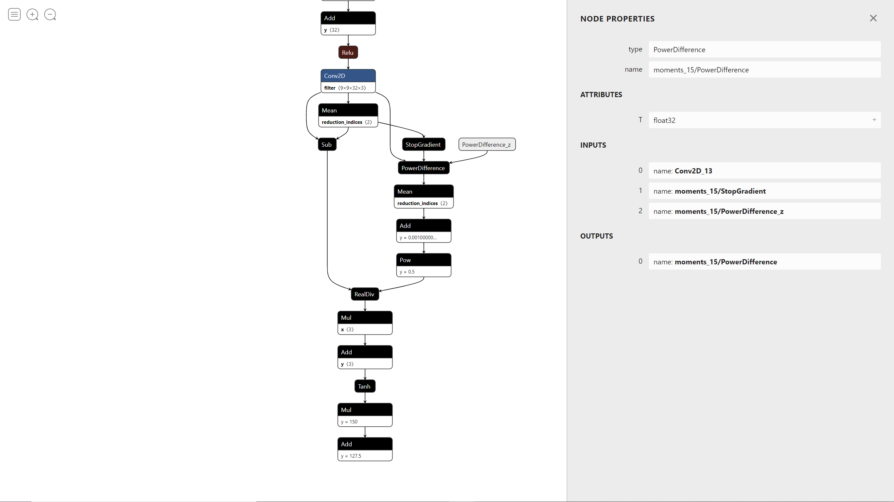

  从图中可以看出除了 X 还额外需要 feed 一个数据，即 PowerDifference_z，给它赋值为2即可，相当于将pow = 2 传递给了计算图

  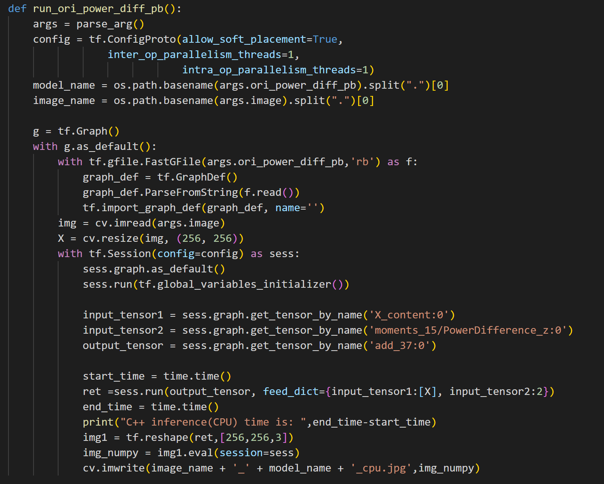

- **run_numpy_pb**：与上一个类似，只不过这里需要我们手动将原生的差平方计算算子的输入数据提出并使用实验一中的power_diff_numpy.py的内置函数进行计算后，再传回计算图进行计算。**需要注意**该函数的输入参数跟上一个run_ori_power_diff_pb的计算图一样的参数，因为这里要手动算，所以在可视化的计算图上可以发现这里断开了。

  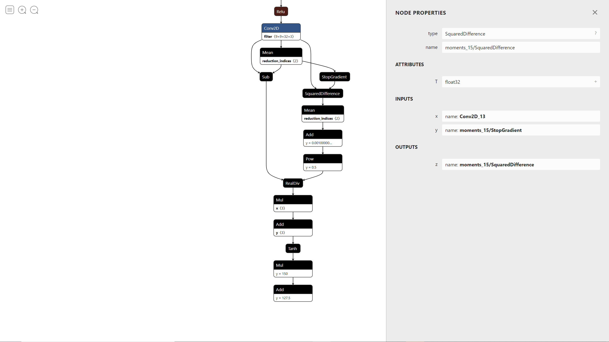

  上面这张图是使用原生的差平方计算算子的模型，可以看到SquaredDifference算子的输入分别为Conv2D_13和 moments_15/StopGradient

  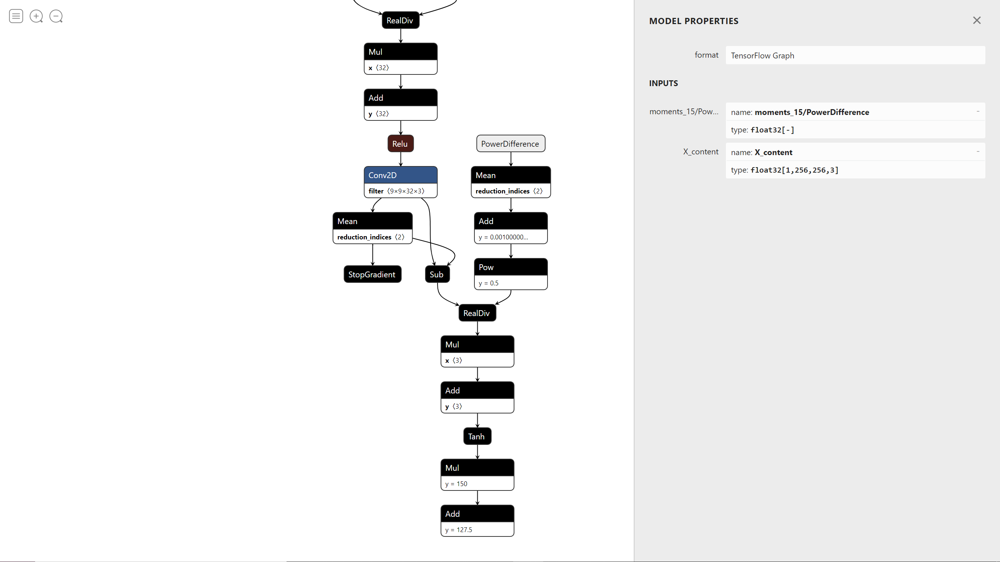

  可以看到这个模型的 Conv2D_13和 moments_15/StopGradient 并没有参与到算子的计算中，所以我们要把这两个节点的数据提取出来，再加上一个 pow 值为 2，作为 power_diff_numpy 的三个参数计算出 PowerDifference 算子的输出结果，此处需要注意的是从计算图中提取出来的 Tensor 不能直接进行 reshape，否则会报错，所以我们要通过 eval() 将其转换为数组，并且要向 eval() feed 一个数据 X

  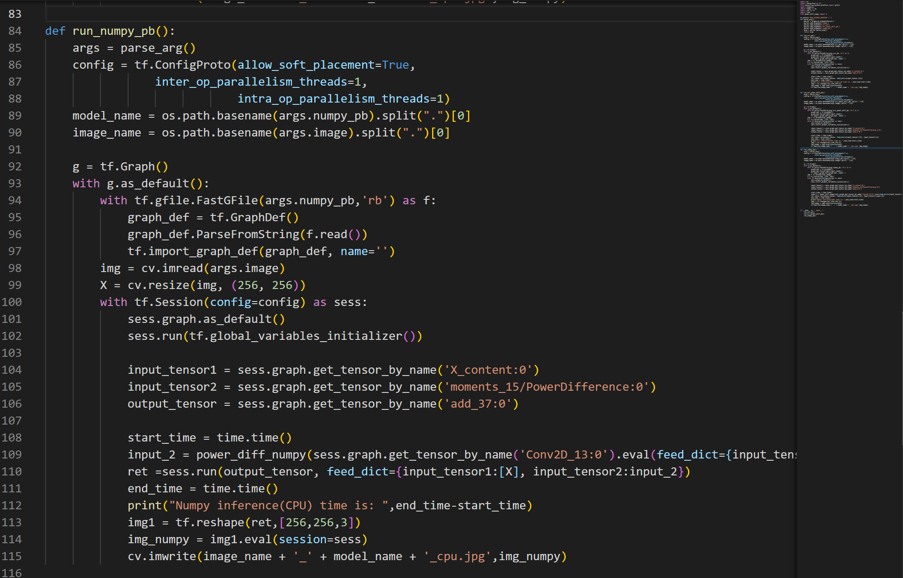

- 全部代码

  ```python
  import os
  import tensorflow as tf
  from tensorflow.python.platform import gfile
  import argparse
  import numpy as np
  import cv2 as cv
  import time
  from power_diff_numpy import *
  
  os.putenv('MLU_VISIBLE_DEVICES','')
  def parse_arg():
      parser = argparse.ArgumentParser()
      parser.add_argument('image')
      parser.add_argument('ori_pb')
      parser.add_argument('ori_power_diff_pb')
      parser.add_argument('numpy_pb')
      args = parser.parse_args()
      return args
  
  def run_ori_pb():
      args = parse_arg()
      config = tf.ConfigProto(allow_soft_placement=True,
                  inter_op_parallelism_threads=1,
                              intra_op_parallelism_threads=1)
      model_name = os.path.basename(args.ori_pb).split(".")[0]
      image_name = os.path.basename(args.image).split(".")[0]
  
      g = tf.Graph()
      with g.as_default():
          with tf.gfile.FastGFile(args.ori_pb,'rb') as f:
              graph_def = tf.GraphDef()
              graph_def.ParseFromString(f.read())
              tf.import_graph_def(graph_def, name='')
          img = cv.imread(args.image)
          X = cv.resize(img, (256, 256))
          with tf.Session(config=config) as sess:
              sess.graph.as_default()
              sess.run(tf.global_variables_initializer())
  
              input_tensor = sess.graph.get_tensor_by_name('X_content:0')
              output_tensor = sess.graph.get_tensor_by_name('add_37:0')
  
              start_time = time.time()
              ret =sess.run(output_tensor, feed_dict={input_tensor:[X]})
              end_time = time.time()
              print("C++ inference(CPU) origin pb time is: ",end_time-start_time)
              img1 = tf.reshape(ret,[256,256,3])
              img_numpy = img1.eval(session=sess)
              cv.imwrite(image_name + '_' + model_name + '_cpu.jpg',img_numpy)
  
  
  def run_ori_power_diff_pb():
      args = parse_arg()
      config = tf.ConfigProto(allow_soft_placement=True,
                  inter_op_parallelism_threads=1,
                              intra_op_parallelism_threads=1)
      model_name = os.path.basename(args.ori_power_diff_pb).split(".")[0]
      image_name = os.path.basename(args.image).split(".")[0]
  
      g = tf.Graph()
      with g.as_default():
          with tf.gfile.FastGFile(args.ori_power_diff_pb,'rb') as f:
              graph_def = tf.GraphDef()
              graph_def.ParseFromString(f.read())
              tf.import_graph_def(graph_def, name='')
          img = cv.imread(args.image)
          X = cv.resize(img, (256, 256))
          with tf.Session(config=config) as sess:
              sess.graph.as_default()
              sess.run(tf.global_variables_initializer())
  
              input_tensor1 = sess.graph.get_tensor_by_name('X_content:0')
              input_tensor2 = sess.graph.get_tensor_by_name('moments_15/PowerDifference_z:0')
              output_tensor = sess.graph.get_tensor_by_name('add_37:0')
  
              start_time = time.time()
              ret =sess.run(output_tensor, feed_dict={input_tensor1:[X], input_tensor2:2})
              end_time = time.time()
              print("C++ inference(CPU) time is: ",end_time-start_time)
              img1 = tf.reshape(ret,[256,256,3])
              img_numpy = img1.eval(session=sess)
              cv.imwrite(image_name + '_' + model_name + '_cpu.jpg',img_numpy)
  
  def run_numpy_pb():
      args = parse_arg()
      config = tf.ConfigProto(allow_soft_placement=True,
                  inter_op_parallelism_threads=1,
                              intra_op_parallelism_threads=1)
      model_name = os.path.basename(args.numpy_pb).split(".")[0]
      image_name = os.path.basename(args.image).split(".")[0]
  
      g = tf.Graph()
      with g.as_default():
          with tf.gfile.FastGFile(args.numpy_pb,'rb') as f:
              graph_def = tf.GraphDef()
              graph_def.ParseFromString(f.read())
              tf.import_graph_def(graph_def, name='')
          img = cv.imread(args.image)
          X = cv.resize(img, (256, 256))
          with tf.Session(config=config) as sess:
              sess.graph.as_default()
              sess.run(tf.global_variables_initializer())
  
              input_tensor1 = sess.graph.get_tensor_by_name('X_content:0')
              input_tensor2 = sess.graph.get_tensor_by_name('moments_15/PowerDifference:0')
              output_tensor = sess.graph.get_tensor_by_name('add_37:0')
  
              start_time = time.time()
              input_2 = power_diff_numpy(sess.graph.get_tensor_by_name('Conv2D_13:0').eval(feed_dict={input_tensor1:[X]}),sess.graph.get_tensor_by_name('moments_15/StopGradient:0').eval(feed_dict={input_tensor1:[X]}),2)
              ret =sess.run(output_tensor, feed_dict={input_tensor1:[X], input_tensor2:input_2})
              end_time = time.time()
              print("Numpy inference(CPU) time is: ",end_time-start_time)
              img1 = tf.reshape(ret,[256,256,3])
              img_numpy = img1.eval(session=sess)
              cv.imwrite(image_name + '_' + model_name + '_cpu.jpg',img_numpy)
  
  
  if __name__ == '__main__':
      run_ori_pb()
      run_ori_power_diff_pb()
      run_numpy_pb()
  
  ```

#### online_mlu

在mlu部分，使用到的模型是量化后的模型文件。

仅仅需要在每个函数前加上

`config.mlu_options.save_offline_model = True`

这句话用于保存量化后可用于mlu的离线模型，其余部分均与cpu相同

### 离线推理

~~令人惊讶的是，当我写完了在线推理之后，提交了一手发现居然拿了满分，于是我还没有写离线推理~~

代码：

```cpp
#include "inference.h"
#include "cnrt.h"
#include <stdio.h>
#include <stdlib.h>
#include <string.h>
#include "stdlib.h"
#include <sys/time.h>
#include <time.h>

namespace StyleTransfer{

typedef unsigned short half;

void cnrtConvertFloatToHalfArray(uint16_t* x, const float* y, int len) {
  for (int i = 0; i < len; i++){
    cnrtConvertFloatToHalf(x+i,y[i]);
  }
}

void cnrtConvertHalfToFloatArray(float* x, const uint16_t* y, int len) {
  for (int i = 0; i < len; i++){
    cnrtConvertHalfToFloat(x+i,y[i]);
  }
}

void cnrtConvertFloatToHalfArray(uint16_t* x, float* y, int len) {
  for (int i = 0; i < len; i++){
    cnrtConvertFloatToHalf(x+i,y[i]);
  }
}

void cnrtConvertHalfToFloatArray(float* x, uint16_t* y, int len) {
  for (int i = 0; i < len; i++){
    cnrtConvertHalfToFloat(x+i,y[i]);
  }
}


Inference :: Inference(std::string offline_model){
    offline_model_ = offline_model;
}

void Inference :: run(DataTransfer* DataT){
    cnrtInit(0);
    cnrtModel_t model;
    cnrtLoadModel(&model, offline_model_.c_str());

    cnrtDev_t dev;
    cnrtGetDeviceHandle(&dev, 0);
    cnrtSetCurrentDevice(dev);
    
    float* input_data = reinterpret_cast<float*>(malloc(256*256*3*sizeof(float)));
    float* output_data = reinterpret_cast<float*>(malloc(256*256*3*sizeof(float)));
    int t = 256*256;
    for(int i=0;i<t;i++)
        for(int j=0;j<3;j++)
            input_data[i*3+j] = DataT->input_data[t*j+i]; 
    int number = 0;
    cnrtGetFunctionNumber(model, &number);

    cnrtFunction_t function;
    cnrtCreateFunction(&function);
    cnrtExtractFunction(&function, model, "subnet0");
    

    int inputNum, outputNum;
    int64_t *inputSizeS, *outputSizeS;
    cnrtGetInputDataSize(&inputSizeS, &inputNum, function);
    cnrtGetOutputDataSize(&outputSizeS, &outputNum, function);

    DataT->output_data = reinterpret_cast<float*>(malloc(256 * 256 * 3 * sizeof(float)));
    half* input_half = (half*)malloc(256 * 256 * 3 * sizeof(half));
    half* output_half = (half*)malloc(256 * 256 * 3 * sizeof(half));
  
    cnrtConvertFloatToHalfArray(input_half, input_data, 256 * 256 * 3);
    cnrtConvertFloatToHalfArray(output_half, DataT->output_data, 256 * 256 * 3);
  
  

    void *mlu_input, *mlu_output;
    cnrtMalloc(&(mlu_input), inputSizeS[0]);
    cnrtMalloc(&(mlu_output), outputSizeS[0]);
    cnrtMemcpy(mlu_input, input_half, 256 * 256 * 3 * sizeof(half), CNRT_MEM_TRANS_DIR_HOST2DEV);
    

    cnrtRuntimeContext_t ctx;
    cnrtCreateRuntimeContext(&ctx, function, NULL);

    cnrtSetRuntimeContextDeviceId(ctx, 0);
    cnrtInitRuntimeContext(ctx, NULL);
    
    void *param[2];
    param[0] = mlu_input;
    param[1] = mlu_output;
    cnrtQueue_t queue;
    cnrtRuntimeContextCreateQueue(ctx, &queue);
    cnrtInvokeRuntimeContext(ctx, (void**)param, queue, nullptr);
    cnrtSyncQueue(queue);
    
    cnrtMemcpy(output_half, mlu_output, 256 * 256 * 3 * sizeof(half), CNRT_MEM_TRANS_DIR_DEV2HOST);
    
    cnrtConvertHalfToFloatArray(output_data, output_half, 256 * 256 * 3);
    for(int i=0;i<t;i++)
        for(int j=0;j<3;j++)
            DataT->output_data[t*j+i] = output_data[i*3+j];
    cnrtFree(mlu_input);
    cnrtFree(mlu_output);
    cnrtDestroyQueue(queue);
    
    cnrtDestroy();
    free(input_half);
    free(output_half);
}

}


```

## 结束语

在这门课程中，~~我根据报错找 bug 的能力确实有了很大的提高~~，虽然体验不是很好，但是自己完成了之后还是挺有成就感的，如果您对于此篇文章有好的提议，或者对于这个实验还有其他的问题，可以向 $wz1234@buaa.edu.cn$ 发送邮件，也欢迎以其他方式和我交流